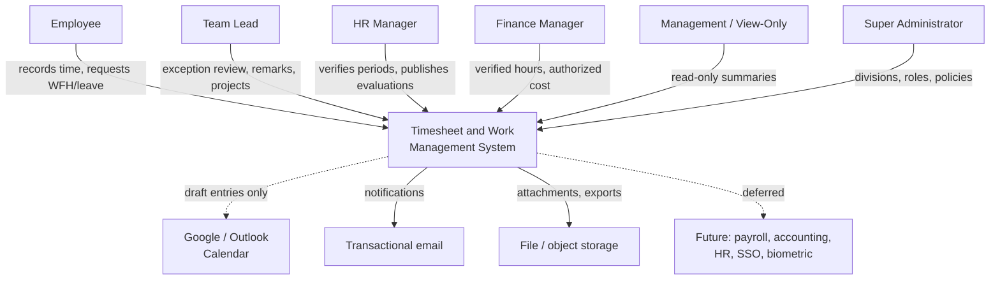
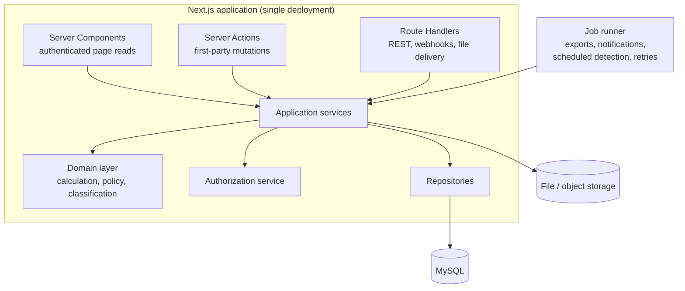
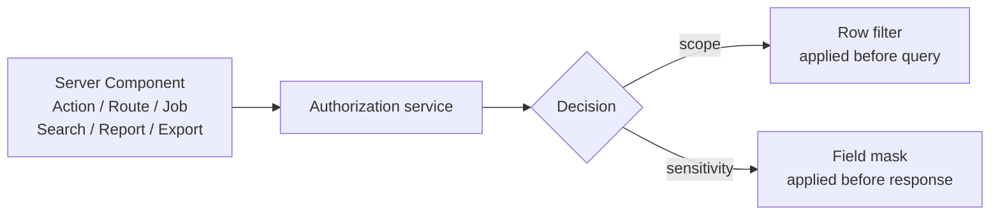
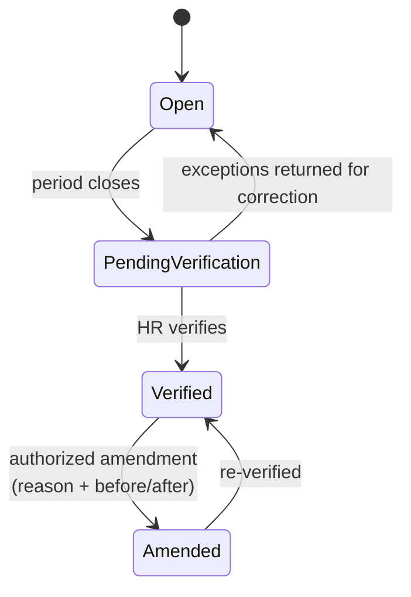

# System Architecture

## Multi-Division Employee Timesheet and Work Management System

| Field | Value |
|---|---|
| Status | Draft — derived from `project_requirement.md` v1.0 |
| Last updated | 2 September 2026 |
| Requirements source | `project_requirement.md` |
| Delivery plans | `frontend_milestone.md`, `backend_milestone.md` |
| Implemented so far | Frontend Phases 0–1 (contracts, design system, shell) |

This document explains *how* the system is structured and *why*. It derives the structure from the requirements rather than restating them, and it distinguishes decisions that are fixed from decisions still open.

---

## 1. Architectural Drivers

Most of this system is ordinary CRUD. Six requirements are not, and they are what actually shape the architecture. Every significant structural decision below traces back to one of them.

| # | Driver | Requirement | Structural consequence |
|---|---|---|---|
| D1 | **One authoritative calculation.** Entry validation, dashboards, reports, exports, evaluations, and APIs must all agree. | `REQ-NFR-OPS-003`, `REQ-DASH-009`, `AC-RPT-002` | A framework-independent calculation engine that every caller shares. No calculation may exist in a component, route handler, or SQL aggregate. |
| D2 | **Reproducible history.** A policy edit today must not change a verified period from last month. | `REQ-NFR-OPS-001`, `REQ-DATA-004`, `AC-WF-003` | Effective-dated, versioned policies; every stored calculation binds the policy version applied. |
| D3 | **Deny by default, at every boundary.** Government-project, salary, cost, evaluation, export and audit data. | `REQ-NFR-SEC-001`, `REQ-NFR-SEC-004`, `AC-AUTH-001`–`005` | A single authorization service consulted by pages, actions, routes, jobs, search, reports and exports — with row *and* field-level decisions. |
| D4 | **No daily approval, but still controlled.** Entries save without a Team Lead; control comes from exception review plus HR period verification. | `REQ-TIME-026`, `REQ-TIME-027`, Assumption §12 | Period state (`open` → `verified` → `amended`) is a first-class concept that gates mutation, not a workflow bolted onto records. |
| D5 | **Idempotent, recoverable time capture.** Timers and saves must survive refresh, retry, and duplicate submission. | `REQ-TIME-008`, `REQ-NFR-PERF-004`, `BAC-TIME-06/07` | Database-enforced single-running-timer invariant; idempotency keys on every time mutation. |
| D6 | **Latency budgets.** 2 s reads / 3 s writes / 5 s dashboards at p95. | `REQ-NFR-PERF-001`–`003` | Derived daily summaries are materialised, not recomputed per request; long work moves to a durable job runner. |

A seventh, softer driver: the system must remain **one deployable application** (`frontend_milestone.md` §2.1). That constrains the container view but not the module structure.

---

## 2. Fixed Constraints

These are settled and not open for re-litigation:

- **One Next.js App Router + TypeScript repository.** Frontend and backend ship together; the backend replaces mock adapters in place.
- **MySQL** is the authoritative operational datastore.
- **Business logic lives in framework-independent services**, never in React components, pages, Server Actions, or Route Handlers.
- **Repositories isolate database access**, so business services and tests do not depend on the chosen query library.
- **UI visibility is not a security control.**
- Integer durations, fixed-precision decimals with explicit currency, UTC instants plus local work date and timezone.
- Historical records are deactivated or versioned, never cascade-deleted.

---

## 3. System Context



Two context-level rules worth stating early:

- **Calendar integration is one-directional and non-authoritative.** External events become *draft* time entries excluded from every total until the employee confirms them (`REQ-INT-002`, `AC-WF-005`).
- **External data gets no shortcut.** Imports, webhooks and API writes pass the same authorization, validation, verification and audit rules as interactive entry (`REQ-INT-008`).

---

## 4. Container View



**Why the entry points are split three ways.** Server Components handle authenticated reads because they avoid a client round-trip for data the server already has. Server Actions handle first-party form mutations where a clean action boundary exists. Route Handlers own anything needing an explicit HTTP contract — the versioned REST API, webhooks, integration callbacks, and authorized file delivery. All three converge on the same application services, so the entry point never changes the rules.

**Why a separate job runner.** `REQ-NFR-PERF-003` requires long exports to run asynchronously with progress and completion notification, and `REQ-NFR-PERF-001` caps interactive latency. Exports over large periods, notification fan-out, scheduled missing-time detection, and integration retries all exceed an interactive budget. The runner calls the same application services — a job is a different *trigger*, not different logic.

---

## 5. Module Structure

Modules are vertical slices with explicit dependencies. A module may depend on those below it, never above.

```
access          identity, sessions, roles, permissions
organization    employees, divisions, assignments, work policies, holidays
work            projects, project members, tasks, checklists
time            entries, timers, breaks, daily summaries, periods, verification
hr              WFH, leave, attendance derivation
evaluation      periods, facts, scoring, weighting, publication
reporting       report queries, exports
finance         cost rates, labour cost, payroll preparation
collaboration   documents, messages, comments
notifications   triggers, delivery, deduplication
integrations    REST API, webhooks, calendar connectors
files           upload, scanning, authorized delivery
audit           append-only event recording
```

Shared layers cut across all of them: **domain rules**, **application services**, **authorization policies**, **repositories**, **job handlers**, and the **contracts** the UI consumes.

`time` is the module everything else reads from and nothing else writes to. `reporting`, `finance`, `evaluation`, and `hr` consume its calculated output; none of them recompute hours. That is the structural expression of driver **D1**.

---

## 6. The Calculation Engine

This is the most important component in the system, and the one most likely to be duplicated by accident.

**Responsibility.** Given an employee, a work date, their valid time entries, the recognized break, the effective work policy, and leave/holiday context, produce a `DailySummary`: active minutes, break minutes, total, required active, remaining, classification, per-division and per-project contributions, attendance state, and the policy version applied.

**Properties it must have:**

- **Pure and framework-independent.** No database, HTTP, or React dependency. Its inputs are values, so it is exhaustively testable at boundaries.
- **The only implementation.** Reports do not re-derive totals in SQL. Dashboards do not sum entries client-side. Exports read the same summaries.
- **Integer arithmetic throughout.** Minutes in, minutes out. `6:59` never becomes `7:00`.
- **Policy-version aware.** It takes the policy as input rather than reading current configuration, which is what makes historical recomputation reproducible.

**Classification boundaries** (`REQ-TIME-016`, `AC-CALC-001`–`004`):

| Condition on the day | Result |
|---|---|
| Required working day, no entry, no approved exemption | Missing |
| Has entries, active < 7:00 **or** total < 8:00 | Under-time |
| Active = 7:00 and total = 8:00 (policy-adjusted) | Complete |
| Total > 8:00 through exactly 12:00 | Overtime — reason required |
| Total > 12:00 | Critical — explanation required, notify Team Lead and HR |

Note the asymmetry that makes this easy to get wrong: **exactly 12:00 is Overtime**, and Under-time requires failing *either* threshold, not both.

**Break handling.** The break is a single recognized daily value, not a per-entry addition (`REQ-TIME-013`, Assumption §12). This is the single most common misreading of the domain, and it is why `DailyBreak` is its own record keyed by employee and date rather than a column on a time entry.

**Materialisation.** `DailySummary` is persisted, not computed per request, to meet **D6**. It is recalculated transactionally whenever a contributing fact changes — an entry, the break, an approved leave, a holiday, or a policy assignment. The trade is deliberate: writes get slower and more complex in exchange for dashboard and report reads that stay inside budget. Because the engine is pure, a stored summary can always be re-derived from its inputs and reconciled, which is what makes the trade safe.

---

## 7. Authorization



**One service, every boundary.** Pages, actions, route handlers, background jobs, search, reports and exports all consult the same policy API. A capability reachable through six entry points must not have six implementations of who may use it.

**Six dimensions of scope**, all of which can apply at once: role, division, project or team, record ownership, date-effectiveness of the assignment, and workflow state.

Date-effectiveness deserves emphasis. A Team Lead's authority is not "these employees" but "these employees *on this date*" (`REQ-DATA-002`, `REQ-ORG-009`). A temporary assignment that ended in August must not grant access to September records, and time cannot be recorded against a division the employee was not assigned to *on the work date*.

**Row filtering precedes aggregation.** Authorization is applied before totals are computed, never after. Otherwise a count, a group total, or an empty-group label leaks the existence of records the viewer cannot see (`REQ-SRCH-003`, `AC-AUTH-004`).

**Field-level masking is a separate decision from row access.** A Finance user without the financial-detail permission sees the row and its hours but not the rate, salary, budget, or labour cost (`REQ-RBAC-017`, `AC-AUTH-003`). The frontend contracts already model this as `Redactable<T>` in `src/contracts/domain.ts`, so a restricted value is *representable* — the field keeps its label and renders as restricted rather than blank or zero, which would misstate the record.

**Existence is itself protected.** An unauthorized record returns the same not-found response as a nonexistent one. Status codes, response timings, search results, counts, file names, and notification text must not distinguish the two (`REQ-NFR-SEC-004`, `AC-AUTH-004`).

**Management/View-Only is enforced server-side.** Removing buttons is not the control; the role must be unable to mutate through any boundary including the API (`REQ-RBAC-020`, `AC-AUTH-005`).

---

## 8. Data Architecture

### 8.1 Core entities

| Domain | Entities |
|---|---|
| Access | User, Role, Permission, UserRole, Session, LoginHistory |
| Organization | Employee, Division, EmployeeDivisionAssignment, Team, WorkPolicy, HolidayCalendar |
| Work | Project, ProjectMember, Task, TaskMember, TaskChecklistItem |
| Time | TimeEntry, TimerSession, DailyBreak, DailySummary, TimesheetPeriod, Verification, Amendment |
| HR | LeaveRequest, WFHRequest, AttendanceDay, EvaluationPeriod, Evaluation, EvaluationResponse, GeneralRemark |
| Finance | CostRate, Budget, PayrollPeriod, ReportDefinition, ReportExport |
| Collaboration | Document, DocumentVersion, Message, Comment, Announcement, Notification, Attachment |
| Control | AuditLog, IntegrationConnection, WebhookDelivery, PolicyVersion |

### 8.2 Time and timezone strategy

Three values are stored for every time fact, and all three are needed:

- **UTC instant** — the unambiguous point in time.
- **Local work date** — which day the work belongs to, decided by policy, not by UTC arithmetic.
- **Business timezone** — how to render and re-derive it.

The local work date is stored rather than computed because cross-midnight work makes the two disagree. A shift from 22:30 to 01:15 is attributed or split according to the configured policy (`REQ-TIME-028`); once decided, that decision must survive a timezone or DST change, which it cannot if the date is derived on read.

### 8.3 Precision

Durations are **integer minutes**. Money is a **fixed-precision decimal with an explicit currency**. Allocation percentages that require precision are integers. Floating point appears nowhere in either, because binary floating point cannot represent decimal money exactly and accumulated rounding across a payroll period produces real errors.

### 8.4 Effective dating

Assignments, work policies, holidays, evaluation weights, and cost rates are all effective-dated. Reports for a past period must use the values that applied *then* (`REQ-DATA-005`). This is why "what is this employee's Team Lead" is never a simple column read — it is a query with a date.

### 8.5 Preservation over deletion

Deactivation and versioning, never cascade deletion (`REQ-DATA-007`, `REQ-ORG-007`). Payroll, audit, and historical reporting all depend on records whose business life has ended. Hard deletion is restricted to unreferenced data through an audited administrative process.

### 8.6 Audit

Append-only for application users (`REQ-NFR-SEC-005`). Each event carries actor, action, resource, scope, timestamp, reason where applicable, correlation ID, and protected before/after values. Secrets, tokens, and credentials are redacted from payloads — an audit log that captures a password is a liability, not a control.

---

## 9. Period Verification and Locking

This is the control model that replaces daily approval, and it is a distinctive part of the design.



- Entries save with **no Team Lead approval** at any point (`REQ-TIME-026`).
- Team Leads review by *exception* — missing, under-time, overtime, critical, overlapping, incomplete, leave-conflicting — and raise a general remark or correction request (`REQ-RMK-007`).
- **HR verification** fixes the period's included records, calculation results, and applied policy version, transactionally (`REQ-TIME-027`).
- After verification, ordinary mutations are rejected with a locked-period conflict. Changes require an authorized amendment carrying a reason, preserving before/after values, recalculating affected summaries, and surfacing to Finance (`AC-WF-003`).
- Finance reporting **defaults to verified periods**; explicitly authorized unverified data is visibly flagged (`REQ-RPT-010`).

The word "verified" means HR period verification. It never implies a Team Lead approved individual entries — a distinction the UI is also required to preserve.

---

## 10. Transactions, Concurrency, and Idempotency

**Transaction boundaries** wrap any operation that changes related records plus derived summaries: saving or editing an entry, stopping a timer, overriding a break, approving leave that alters requirements, verifying a period, amending a verified record, and importing external data.

**The single-timer invariant** (`REQ-TIME-008`) is enforced by the *database*, not by application checks. A read-then-write guard loses the race; a partial unique constraint on running timers per employee cannot. Two concurrent start requests must yield exactly one active timer (`BAC-TIME-06`).

**Overlap detection spans divisions.** An employee cannot be in two places at once, so entries for the same employee are checked against each other regardless of which division they belong to (`REQ-TIME-020`, `AC-CALC-005`). This is the check most likely to be scoped too narrowly.

**Idempotency keys** accompany every time mutation and export request. A retried timer-stop, a duplicate form submission, or a replayed webhook must not create a second entry or a second export (`REQ-NFR-PERF-004`, `BAC-TIME-07`). The frontend contracts already carry `IdempotentInput` on these operations.

**Optimistic versioning** guards concurrent edits to the same record, so a stale write is rejected rather than silently overwriting a colleague's correction.

---

## 11. Asynchronous Work

Handled by the durable job runner rather than a request:

| Job class | Why it cannot be interactive |
|---|---|
| Report exports (Excel, CSV, PDF) | Unbounded period size; exceeds latency budget (`REQ-NFR-PERF-003`) |
| Notification generation and delivery | Fan-out to many recipients and external providers |
| Scheduled missing-time and exception detection | Daily/monthly sweeps across all employees (`REQ-NOT-003`) |
| Integration synchronization and retries | External provider latency and failure |

Every job is **idempotent and retryable with backoff**, records its state, and dead-letters on repeated failure. Scheduled detection must be safe to run twice — a second run on the same day produces no duplicate exceptions and no duplicate notifications (`REQ-NOT-005`).

**Export lifecycle:** `queued → processing → ready → expired`, with `failed` and `cancelled` as terminal alternatives. Artifacts are stored with protected, expiring access, and **authorization is re-checked at download time**, not only at request time — permissions may have changed in between. Request, completion, failure, download, expiry and deletion are all audited (`REQ-RPT-008`).

Generation is bounded in memory (streamed, not fully materialised) and applies formula-injection protection for spreadsheet formats.

---

## 12. Reporting

Reports are a **permission-aware query layer over the same calculated results** the rest of the system uses. They never contain their own hours arithmetic.

Every report carries provenance: reporting period, applied filters, timezone, generation timestamp, and policy version (`REQ-RPT-009`). Without the policy version, a report cannot be reproduced after a policy change.

The reconciliation requirement is strict: employee-, division-, project-, and task-grouped reports over identical filters must produce the **same** authorized active-time total, and dashboards, reports, exports, evaluations and Finance views must agree for the same period, timezone and policy version (`AC-RPT-001`, `AC-RPT-002`). This is achievable only because of driver **D1** — it is not something that can be reconciled after the fact between independent implementations.

---

## 13. Files and Attachments

Upload is a two-step initiate/complete flow with size and type validation, a malware-scanning integration point, and integrity metadata. Attachments record their owning record, uploader, access scope, timestamp, media type, size, and integrity reference (`REQ-DATA-006`).

Delivery is authorized per request through short-lived or streamed access — never a guessable public URL. Attachments inherit the division, project, and role permissions of the record that owns them (`REQ-WORK-009`), and protected downloads are audited (`REQ-DOC-005`). Government-project documents are denied by default (`REQ-DOC-004`).

---

## 14. Integrations

**Outbound REST API and webhooks** are versioned, authenticated, scoped, paginated, rate-limited, and documented with a deprecation policy (`REQ-NFR-OPS-004`). Webhook delivery is signed, retried with backoff, replay-protected, idempotent, and logged.

**Calendar connectors** (Google, Outlook) convert events into **draft** time entries only. Drafts are excluded from every total and every report until the employee reviews, completes the required fields, and saves — at which point normal validation applies (`REQ-INT-002`, `AC-WF-005`).

**Future connectors** — Gmail, Microsoft 365, Drive, OneDrive, Meet, Zoom, Slack, Jira, biometric attendance, payroll, accounting, HR systems, SSO, Zapier/Make — are accommodated behind adapter interfaces but not built.

Credentials are scoped, encrypted at rest, and never written to logs or audit payloads.

---

## 15. Observability and Performance

**Structured logs** carry a correlation ID, safe actor and resource references, severity, duration and outcome. They contain no credentials, session tokens, protected file content, private evaluations, salary or cost details (`REQ-NFR-SEC-007`, `REQ-NFR-OPS-002`).

**Metrics** cover request latency and error rate, connection-pool health, job lag, notification delivery, export throughput, and integration retries. **Alerts** fire on authentication anomalies, authorization-denial spikes, job and export failures, integration failures, and database health.

**Performance approach**, in order of preference:

1. Materialised daily summaries, so dashboards and reports read pre-computed rows.
2. Indexes driven by *measured* slow queries and query plans, not by assumption.
3. Pagination and bounded result sets everywhere, including search and exports.
4. Caching only where authorization, invalidation, verification state, timezone and policy version all remain correct — which is a narrow set. A cache that outlives a permission change is a data leak, so anything permission-scoped is cached per principal or not at all.

Targets: **2 s** p95 interactive reads, **3 s** p95 writes, **5 s** dashboards and standard reports (`REQ-NFR-PERF-001`, `-002`).

---

## 16. Backup and Recovery

Automated, monitored backups of application data and protected file content on the approved retention schedule, encrypted at rest. Restoration is tested **before go-live and at a defined recurring interval** — an untested backup is an assumption, not a control (`REQ-NFR-BACKUP-002`). Recovery procedures document responsible roles, recovery order across database, files, jobs, integrations and credentials, verification steps, and communication paths.

Availability, RTO and RPO must be agreed and verified operationally before go-live (`REQ-NFR-PERF-005`).

---

## 17. Frontend Architecture

Already implemented through Phase 1.

**The service boundary is the whole point.** UI components never import fixtures. Pages and feature modules consume data only through typed interfaces in `src/contracts/services.ts`, so the MySQL implementation replaces mock adapters without redesigning screens.

**Results are values, not exceptions.** Every operation resolves to `Result<T>` — success, validation failure with field-level guidance, permission denied, unauthenticated, not found, conflict including locked-period, or error. Components branch on `status` and never inspect transport details.

**View models are pre-authorized and pre-formatted.** Components do not recompute totals, re-derive statuses, or re-check permissions.

**Presentation invariants** enforced in the design system: status renders as shape + text + colour, never colour alone; durations use one central formatter and never round; restricted fields keep their label and render as restricted; no page-level horizontal scrolling at any target width.

Two automated gates run in CI: a contrast audit that parses the real design tokens, and a responsive audit driving Chromium at 375/768/1024/1440 px.

---

## 18. Open Architectural Decisions

These are **not yet made**. The backend milestone (`BE-0007`–`BE-0014`) owns them, and each has selection criteria rather than a default.

| Decision | Must satisfy | Owner |
|---|---|---|
| ORM or query builder | Transactions, compound indexes, migrations, decimal handling, date/time handling, Next.js deployment compatibility | Backend lead |
| Authentication and session implementation | Credentials, database-backed sessions, 2FA, reset flows, revocation, server-side authorization integration | Backend lead + security owner |
| Schema-validation library | Shared server/client validation ownership | Backend lead |
| Durable job mechanism | Exports, notifications, scheduling, integration retries, idempotency, monitoring | Backend + operations |
| File/object storage | Attachments, exports, malware scanning, local development behavior | Operations + security |
| Transactional email provider | Notification delivery with status recording | Product + operations |
| Runtime and deployment topology | Persistent Node server, containers, or another Next.js-compatible runtime; must support a job runner | Backend + operations |
| MySQL environment | Version, character set, collation, SQL mode, connection pooling, migration ownership | Backend lead |

Also open, and required from the business rather than engineering: authoritative employee and assignment data, payroll period and retention policy, cost-rate and billable rules, availability/RTO/RPO targets, and government-project access policy.

---

## 19. Architectural Risks

| Risk | Consequence | Mitigation |
|---|---|---|
| Calculation logic duplicated into a report, dashboard, or SQL aggregate | Totals diverge; payroll disputes | One engine, shared by every caller; reconciliation tests across dashboard, report, export, evaluation and Finance |
| Authorization applied after aggregation | Counts and totals leak unauthorized records | Row filtering before aggregation; explicit tests on counts, empty groups, and search |
| Floating-point durations or money | Incorrect payroll totals | Integer minutes and fixed decimals enforced in the schema and the type system |
| Cross-midnight or DST ambiguity | Wrong daily status and overtime | Store UTC + local work date + timezone + policy version; boundary tests |
| Race in timer start or period verification | Duplicate time; shifting payroll totals | Database constraints, transactions, idempotency keys, version checks, concurrency tests |
| Policy edit rewrites history | Past reports stop reproducing | Versioned policies; verified periods bound to the applied version |
| Long work inside the request lifecycle | Timeouts; lost exports and notifications | Durable job runner with retries, idempotency and monitoring |
| Permission cached past a revocation | Data leak | Cache only what is principal-scoped or permission-independent |
| Hard deletion of referenced records | Missing payroll and audit evidence | Deactivation and versioning; audited hard deletion limited to unreferenced data |
| Frontend contracts drift during backend work | Rework and inconsistent errors | Versioned service contracts, contract tests, feature-by-feature integration |

---

## 20. Traceability

| Architectural element | Primary requirements |
|---|---|
| Calculation engine | `REQ-TIME-011`–`019`, `REQ-NFR-OPS-003`, `REQ-DASH-009`, `AC-CALC-001`–`007` |
| Authorization service | `REQ-RBAC-001`–`020`, `REQ-NFR-SEC-001`, `-004`, `AC-AUTH-001`–`005` |
| Period verification | `REQ-TIME-026`–`027`, `REQ-RBAC-015`, `AC-WF-001`, `-003` |
| Effective dating | `REQ-ORG-005`–`010`, `REQ-DATA-002`, `-005` |
| Audit | `REQ-NFR-SEC-005`, `REQ-DATA-008`, `AC-WF-002` |
| Job runner | `REQ-NFR-PERF-003`, `REQ-NOT-005`, `REQ-RPT-008` |
| Reporting layer | `REQ-RPT-001`–`010`, `AC-RPT-001`–`003` |
| File handling | `REQ-DATA-006`, `REQ-WORK-009`, `REQ-DOC-004`–`005` |
| Integrations | `REQ-INT-001`–`008`, `AC-WF-005` |
| Observability | `REQ-NFR-OPS-002`, `REQ-NFR-SEC-007` |
| Backup and recovery | `REQ-NFR-BACKUP-001`–`003`, `AC-QUAL-003` |
| Frontend contracts | `frontend_milestone.md` §2.1, `FE-0014`–`FE-0019` |
